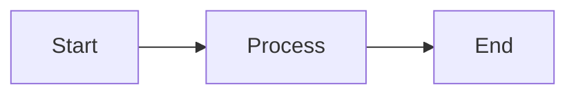
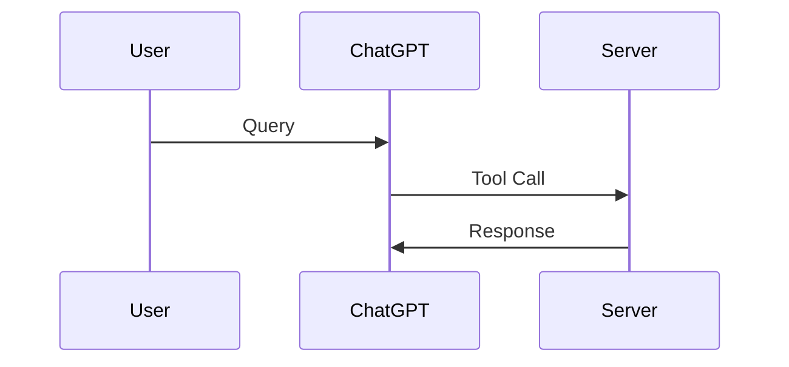

# Slidev Presentation Cheat Sheet

## Quick Commands

### Running the Presentation

```bash
# From project root
npm run slides

# From docs folder
npm run dev

# Opens at: http://localhost:3030
```

### Building/Exporting

```bash
# Export as PDF
npm run slides:export    # From root
npm run export           # From docs/

# Build static site
npm run slides:build     # From root
npm run build            # From docs/
```

## Keyboard Shortcuts

### Navigation
| Key | Action |
|-----|--------|
| `Space` | Next slide |
| `→` | Next slide |
| `↓` | Next slide |
| `←` | Previous slide |
| `↑` | Previous slide |
| `Home` | First slide |
| `End` | Last slide |

### Views
| Key | Action |
|-----|--------|
| `O` | Toggle overview |
| `G` | Go to slide (enter number) |
| `F` | Toggle fullscreen |
| `P` | Presenter mode |

### Display
| Key | Action |
|-----|--------|
| `D` | Toggle dark mode |
| `C` | Toggle click animations |
| `M` | Toggle drawing mode |

### Other
| Key | Action |
|-----|--------|
| `?` | Show shortcuts |
| `Esc` | Exit current mode |

## Presenter Mode Features

Press `P` to enter presenter mode:

- **Left**: Current slide (what audience sees)
- **Right**: Next slide preview
- **Bottom**: Speaker notes (if any)
- **Timer**: Session duration
- **Controls**: Navigation buttons

## Slide Structure

### Basic Slide
```markdown
---
# This is a separator between slides
---

# Slide Title

Content goes here
```

### With Layout
```markdown
---
layout: center
---

# Centered Content
```

### With Clicks
```markdown
# Title

<v-click>

This appears on first click

</v-click>

<v-click>

This appears on second click

</v-click>
```

### Two Columns
```markdown
---
layout: two-cols
---

# Left Column Content

::right::

# Right Column Content
```

## Code Blocks

### Basic Code
````markdown
```typescript
const hello = "world";
```
````

### With Line Highlighting
````markdown
```typescript {1-3|5-7|9}
// Lines 1-3 highlight first
const a = 1;
const b = 2;

// Then lines 5-7
const c = 3;
const d = 4;

// Then line 9
const e = 5;
```
````

### With Line Numbers
````markdown
```typescript {1|2|3}
// Line 1
// Line 2
// Line 3
```
````

## Diagrams

### Mermaid Diagram
````markdown

````

### Sequence Diagram
````markdown

````

## Customization

### Frontmatter (First Slide)
```yaml
---
theme: default
background: url
highlighter: shiki
lineNumbers: true
title: My Presentation
---
```

### Per-Slide Frontmatter
```yaml
---
layout: center
background: '#1a1a1a'
class: text-white
---
```

## Images

### Markdown Syntax
```markdown

```

### HTML with Styling
```markdown

```

## Tips

### Presenting Live

1. Open presenter mode (`P`)
2. Share screen (choose window with current slide)
3. Use overview (`O`) to jump to sections
4. Use dark mode (`D`) for better visibility

### Recording

1. Use fullscreen mode (`F`)
2. Disable click animations (`C`) for smoother flow
3. Consider exporting to PDF first

### Sharing

**As PDF:**
```bash
npm run slides:export
# Share: slides-export.pdf
```

**As Website:**
```bash
npm run slides:build
# Deploy: dist/ folder to any static host
```

## Common Layouts

| Layout | Use Case |
|--------|----------|
| `default` | Standard content |
| `center` | Centered title/content |
| `two-cols` | Side-by-side comparison |
| `image-right` | Content + image |
| `quote` | Large quotes |
| `section` | Section dividers |
| `end` | Closing slide |

## Transitions

Add to slide frontmatter:
```yaml
---
transition: slide-left
---
```

Options:
- `slide-left`
- `slide-right`
- `slide-up`
- `slide-down`
- `fade`
- `none`

## URL Parameters

Access presentation with parameters:

- `?presenter` - Presenter mode
- `?print` - Print/PDF mode
- `?embedded` - Embedded mode
- `?clicks=3` - Show up to click 3

Example:
```
http://localhost:3030?presenter
```

## Development

### Watch Mode (Auto-reload)
```bash
npm run dev
```

### Build Performance
```bash
npm run build -- --base /my-slides/
```

## Troubleshooting

### Presentation Won't Start
```bash
# Clear cache
rm -rf node_modules
npm install

# Try again
npm run dev
```

### Diagrams Not Showing
- Check Mermaid syntax
- Ensure proper code fence (triple backticks)
- Try different scale: `{scale: 0.5}`

### Code Not Highlighting
- Verify language identifier
- Check for syntax errors in code
- Try different highlighter in frontmatter

### Export Fails
```bash
# Install Playwright browsers
npx playwright install

# Try export again
npm run export
```

## Quick Reference

**Start:** `npm run slides`  
**Next:** `Space` or `→`  
**Previous:** `←`  
**Overview:** `O`  
**Presenter:** `P`  
**Fullscreen:** `F`  
**Dark Mode:** `D`  
**Help:** `?`

## Resources

- [Slidev Docs](https://sli.dev/)
- [Theme Gallery](https://sli.dev/themes/gallery.html)
- [Examples](https://sli.dev/showcases.html)

