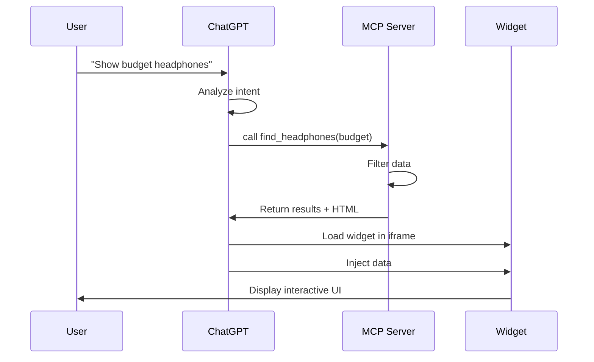
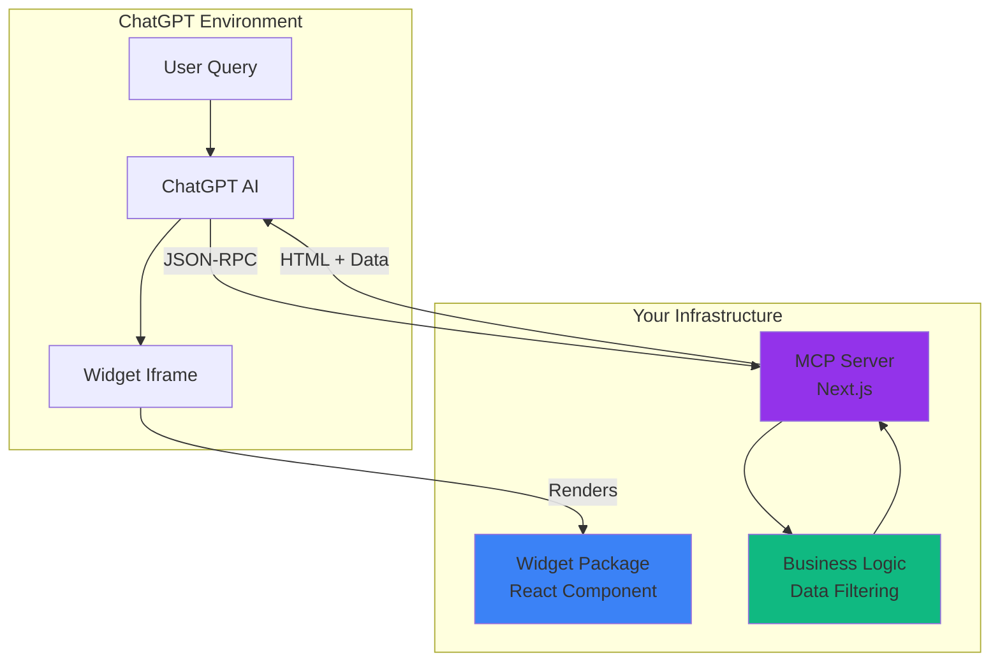
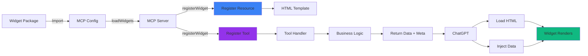

# Building ChatGPT Apps with MCP

An Educational Guide to the Model Context Protocol

<div class="pt-12">
  <span @click="$slidev.nav.next" class="px-2 py-1 rounded cursor-pointer" hover="bg-white bg-opacity-10">
    Press Space for next page <carbon:arrow-right class="inline"/>
  </span>
</div>

---
layout: center
---

# What is a ChatGPT App?

<v-clicks>

- Interactive widgets that appear **inside** ChatGPT conversations
- Responds to natural language queries
- Renders rich UI (carousels, cards, charts, etc.)
- Combines AI understanding with custom business logic

</v-clicks>

<div v-after class="mt-8 text-center">
  
</div>

---

# What Really is a ChatGPT App?

<div class="grid grid-cols-2 gap-8">

<div>

## Traditional Apps
- User → UI → Backend
- Direct HTTP requests
- Explicit button clicks
- Fixed navigation paths

</div>

<div v-click>

## ChatGPT Apps
- User → ChatGPT → **MCP Server**
- Natural language intent
- AI decides when to call tools
- Dynamic, conversational flow

</div>

</div>

<div v-click class="mt-8 p-4 bg-blue-500/10 rounded-lg">
<strong>Key Difference:</strong> ChatGPT acts as an intelligent middleware that interprets user intent and calls your tools at the right time.
</div>

---

# Tool Structure

ChatGPT apps are built on **tools** - functions that ChatGPT can call

```typescript {all|1-4|6-10|12-16}
// Tool Definition
{
  name: "find_headphones",
  description: "Find headphones based on filters",
  
  // Input schema (what ChatGPT sends)
  inputSchema: {
    priceBracket: "budget" | "midrange" | "premium",
    activity: "commuting" | "gaming" | "studio" | "fitness"
  },
  
  // Tool execution (your business logic)
  handler: async (input) => {
    const results = filterHeadphones(input);
    return { headphones: results };
  }
}
```

---
layout: two-cols
---

# How It Works




---
layout: center
class: text-center
---

# TechGear Demo

## An Electronics Shopping Assistant

<div class="mt-1">
</div>

<div class="mt-4 text-xl">
  "Show me budget headphones for gaming"
</div>

---

# Basic Parts of a ChatGPT App

<div class="grid grid-cols-3 gap-6 mt-8">

<div v-click="1" class="p-4 bg-purple-500/10 rounded-lg">

### 🖥️ MCP Server
- Next.js application
- Exposes `/mcp` endpoint
- Handles JSON-RPC protocol
- Registers tools & resources

</div>

<div v-click="2" class="p-4 bg-blue-500/10 rounded-lg">

### 🎨 Widget Package
- React component
- Business logic
- Data & filtering
- Self-contained & reusable

</div>

<div v-click="3" class="p-4 bg-green-500/10 rounded-lg">

### 🧪 Playground
- Local testing environment
- MCPJam Inspector
- Debug before ChatGPT
- Free AI models

</div>

</div>

<div v-click="4" class="mt-8 text-center text-lg">
<strong>Tech Stack:</strong> Next.js + React + TypeScript + Zod + MCP SDK
</div>

---

# Architecture Overview



---

# Project Layout

<style>
pre, code, .shiki {
  font-size: 0.55rem !important;
  line-height: 1.2 !important;
}
</style>

```
techgear/
├── packages/
│   ├── mcp/                          # Next.js MCP Server
│   │   ├── src/
│   │   │   ├── app/
│   │   │   │   ├── mcp/route.ts      # MCP endpoint
│   │   │   │   ├── widgets/          # Preview pages
│   │   │   │   │   └── headphones/
│   │   │   │   │       └── page.tsx
│   │   │   │   └── page.tsx          # Homepage
│   │   │   └── lib/
│   │   │       ├── types.ts          # Type definitions
│   │   │       ├── helpers.ts        # Metadata creators
│   │   │       └── loadWidgets.ts    # Dynamic loader
│   │   ├── mcp.config.ts             # Widget registry
│   │   └── next.config.ts            # Critical config!
│   │
│   ├── widgets/
│   │   └── headphones-widget/        # Widget package
│   │       └── src/
│   │           ├── components/       # React UI
│   │           ├── data/             # Business logic
│   │           ├── hooks/            # ChatGPT integration
│   │           ├── semantic/         # Zod schemas
│   │           └── register.ts       # MCP registration
│   │
│   └── playground/                   # Testing
│       └── mcp.config.json           # Inspector config
```


---
layout: center
class: text-center
---

# Building a Widget

## Let's Break It Down

<div class="mt-12 grid grid-cols-5 gap-4">
  <div v-click="1" class="p-4 bg-blue-500/20 rounded">1️⃣ Data</div>
  <div v-click="2" class="p-4 bg-purple-500/20 rounded">2️⃣ Schemas</div>
  <div v-click="3" class="p-4 bg-green-500/20 rounded">3️⃣ UI</div>
  <div v-click="4" class="p-4 bg-yellow-500/20 rounded">4️⃣ Integration</div>
  <div v-click="5" class="p-4 bg-red-500/20 rounded">5️⃣ Registration</div>
</div>

---

# Step 1: Data & Logic

Define your data and filtering logic
<style>
pre, code, .shiki {
  font-size: 0.55rem !important;
  line-height: 1.2 !important;
}
</style>
```typescript {all|1-12|14-28}
// src/data/headphones.ts
export const HEADPHONES: Headphone[] = [
  {
    id: "arc-commuter",
    name: "ArcSound Metro ANC",
    priceBracket: "budget",
    activity: "commuting",
    style: "over-ear",
    price: "$99",
    description: "Lightweight ANC cans with USB-C fast charging",
  },
  // ... more headphones
];

export function filterHeadphones(
  priceBracket?: string,
  activity?: string,
  style?: string
): Headphone[] {
  return HEADPHONES.filter((headphone) => {
    const priceMatch = !priceBracket || 
                       priceBracket === "all" || 
                       headphone.priceBracket === priceBracket;
    const activityMatch = !activity || 
                          activity === "all" || 
                          headphone.activity === activity;
    return priceMatch && activityMatch;
  });
}
```

---

# Step 2: Zod Schemas
<style>
pre, code, .shiki {
  font-size: 0.55rem !important;
  line-height: 1.2 !important;
}
</style>
Runtime validation + TypeScript types from a single source

```typescript {all|1-10|12-20|22-24}
// src/semantic/contracts.ts
import z from "zod";

export const FindHeadphonesToolInputContract = z.object({
  priceBracket: z.enum(["budget", "midrange", "premium", "all"])
    .optional()
    .describe("Price range filter"),
  activity: z.enum(["commuting", "gaming", "studio", "fitness", "all"])
    .optional()
    .describe("Activity filter"),
});

export const HeadphoneContract = z.object({
  id: z.string(),
  name: z.string(),
  priceBracket: z.enum(["budget", "midrange", "premium"]),
  activity: z.enum(["commuting", "gaming", "studio", "fitness"]),
  price: z.string(),
  description: z.string(),
});

// TypeScript types inferred from schemas
export type FindHeadphonesToolInput = z.infer<typeof FindHeadphonesToolInputContract>;
export type Headphone = z.infer<typeof HeadphoneContract>;
```

<div v-click class="mt-4 p-3 bg-yellow-500/10 rounded">
<strong>Why Zod?</strong> Single schema provides both compile-time types AND runtime validation!
</div>

---


# Step 3: ChatGPT Integration

The critical hook that receives data from ChatGPT

```typescript {all|1-5|7-21|23-30}
// src/hooks/useOpenAI.ts
import { useSyncExternalStore } from "react";

// ChatGPT fires this event when it updates window.openai
const SET_GLOBALS_EVENT_TYPE = "openai:set_globals";

function useOpenAIGlobal<K extends keyof any>(key: K): any {
  return useSyncExternalStore(
    // Subscribe to changes
    (onChange) => {
      const handleSetGlobal = (event: CustomEvent) => {
        if (event.detail?.globals?.[key]) {
          onChange(); // Trigger React re-render
        }
      };
      window.addEventListener(SET_GLOBALS_EVENT_TYPE, handleSetGlobal);
      return () => window.removeEventListener(SET_GLOBALS_EVENT_TYPE, handleSetGlobal);
    },
    // Get current value
    () => window.openai?.[key] ?? null,
    () => null // Server snapshot
  );
}

// Hook to get widget data
export function useWidgetProps<T>(defaultState?: T): T | null {
  const toolOutput = useOpenAIGlobal("toolOutput") as T | null;
  const fallback = typeof defaultState === "function" ? defaultState() : defaultState;
  return toolOutput ?? fallback;
}
```

---

# Why Event-Driven Reactivity?

<div class="grid grid-cols-2 gap-6">

<div>

## ❌ Old Way: Polling

```typescript
useEffect(() => {
  const intervalId = setInterval(() => {
    if (window.openai?.toolOutput) {
      setData(window.openai.toolOutput);
    }
  }, 1000); // Check every second
  
  return () => clearInterval(intervalId);
}, []);
```

**Problems:**
- 🐌 1 second delay
- 🔥 Wastes CPU cycles
- 🐛 Timing issues
- 🚫 Not React 18 compliant

</div>

<div>

## ✅ New Way: Events

```typescript
useSyncExternalStore(
  (onChange) => {
    window.addEventListener(
      "openai:set_globals", 
      onChange
    );
    return () => window.removeEventListener(
      "openai:set_globals", 
      onChange
    );
  },
  () => window.openai?.toolOutput
);
```

**Benefits:**
- ⚡ Immediate response
- 💚 Zero polling overhead
- ✅ React 18+ best practice
- 🎯 Official OpenAI pattern

</div>

</div>

---

# Step 4: React Component

Build the UI that renders in ChatGPT

```typescript {all|1-8|10-16|18-30}
// src/components/HeadphonesWidget.tsx
"use client";
import { useWidgetProps } from "../hooks/useOpenAI";

export function HeadphonesWidget({ fallbackData }: HeadphonesWidgetProps) {
  // Get data from ChatGPT or use fallback for preview
  const toolOutput = useWidgetProps<{ headphones: Headphone[] }>(fallbackData);
  
  if (!toolOutput) {
    return <div className="flex items-center justify-center p-12">
      <div className="animate-spin rounded-full h-8 w-8 border-b-2" />
      <span className="ml-3">Loading headphones...</span>
    </div>;
  }

  const { headphones, summary } = toolOutput;

  return (
    <div className="min-h-screen bg-gradient-to-br from-gray-50 to-gray-100 p-6">
      <div className="max-w-6xl mx-auto">
        {summary && <p className="text-lg mb-6">{summary}</p>}
        <div className="grid grid-cols-1 md:grid-cols-2 lg:grid-cols-3 gap-6">
          {headphones.map((headphone) => (
            <HeadphoneCard key={headphone.id} headphone={headphone} />
          ))}
        </div>
      </div>
    </div>
  );
}
```

---

# Step 5: AI-Facing Descriptions

Teach ChatGPT when and how to use your tool

```typescript {all|1-15|17-20}
// src/semantic/prompts.ts
export const headphonesWidgetPrompts = {
  toolTitle: "Find Headphones",
  
  toolDescription: `Find and filter headphones based on price, activity, and style.

Use this tool when users ask about headphones, earbuds, or audio equipment.

Examples:
- "Show me budget headphones"
- "Find gaming headphones"
- "I need over-ear headphones for commuting"
- "What headphones do you have for the gym?"

Filters: priceBracket (budget/midrange/premium), activity (commuting/gaming/studio/fitness)`,

  resourceTitle: "Headphones Widget HTML",
  resourceDescription: "HTML template for the interactive headphones carousel widget",
  widgetDescription: "Displays an interactive carousel of headphone recommendations",
};
```

<div v-click class="mt-4 p-3 bg-blue-500/10 rounded">
<strong>Pro Tip:</strong> Be explicit, provide examples, use natural language. ChatGPT learns from these descriptions!
</div>

---

# Step 6: MCP Registration

Connect your widget to the MCP server

```typescript {all|1-15|17-30|32-42}
// src/register.ts
async function registerWidget(context: WidgetContext): Promise<void> {
  const { server, logger, getHtml, basePath } = context;
  
  // Fetch widget HTML from Next.js
  const html = await getHtml(basePath); // e.g., "/widgets/headphones"
  
  // STEP 1: Register HTML resource
  server.registerResource(
    "headphones-widget",
    "ui://widget/headphones-template.html", // Template URI
    {
      title: headphonesWidgetPrompts.resourceTitle,
      mimeType: "text/html+skybridge", // CRITICAL!
      _meta: createResourceMeta(
        headphonesWidgetPrompts.widgetDescription,
        true // prefersBorder
      ),
    },
    async (uri: URL) => ({
      contents: [{
        uri: uri.href,
        mimeType: "text/html+skybridge",
        text: `<html>${html}</html>`,
      }],
    })
  );
  
  // STEP 2: Register tool
  server.registerTool(
    "find_headphones",
    {
      title: headphonesWidgetPrompts.toolTitle,
      description: headphonesWidgetPrompts.toolDescription,
      inputSchema: FindHeadphonesToolInputContract.shape,
      _meta: createWidgetMeta(headphonesWidgetMetadata),
    },
    async (input) => {
      const headphones = filterHeadphones(input.priceBracket, input.activity);
      return {
        content: [{ type: "text", text: "Found headphones" }],
        structuredContent: { headphones },
        _meta: createWidgetMeta(headphonesWidgetMetadata),
      };
    }
  );
}
```

---

# Widget Registration Flow



---

# Widget Package Exports

Create a clean public API

```typescript
// src/index.ts - Public exports

// Types
export * from "./types";

// Configuration
export * from "./config";

// Registration function
export * from "./register";

// React component (for preview pages)
export * from "./components/HeadphonesWidget";

// Hooks (reusable for other widgets)
export * from "./hooks/useOpenAI";
```

<div class="mt-8">

## Then Build It!

```bash
cd packages/widgets/headphones-widget
npm run build
```

This compiles TypeScript → JavaScript in `dist/` folder

</div>

---
layout: center
class: text-center
---

# MCP Server Setup

## Bringing It All Together

<div class="mt-8 text-6xl">
🖥️ ↔️ 🎨 ↔️ 🤖
</div>

---

# MCP Server: Widget Registry

Central configuration for all widgets

```typescript {all|1-9|11-22}
// mcp.config.ts
import { headphonesWidgetPackage } from "headphones-widget";

interface WidgetRegistryEntry {
  package: WidgetPackage;
  mcp: {
    enabled: boolean;      // Toggle on/off
    production: boolean;   // Include in prod?
    basePath: string;      // Where to find HTML
  };
}

const config: McpConfig = {
  widgets: {
    headphones: {
      package: headphonesWidgetPackage,
      mcp: {
        enabled: true,
        production: true,
        basePath: "/widgets/headphones",
      },
    },
    // Add more widgets here without changing server code!
  },
};

export default config;
```

---

# MCP Server: The Endpoint

```typescript {all|1-20|22-28}
// src/app/mcp/route.ts
import { createMcpHandler } from "mcp-handler";
import { loadWidgets } from "@/lib/loadWidgets";

const handler = createMcpHandler(async (server) => {
  const context = {
    server,
    logger: {
      info: console.info.bind(console),
      error: console.error.bind(console),
    },
    getHtml: async (path: string) => {
      const baseURL = getBaseURL();
      const result = await fetch(`${baseURL}${path}`, {
        cache: "no-store",
      });
      return await result.text();
    },
  };

  // Load all enabled widgets from config
  await loadWidgets(context);
});

// Export both GET and POST
// ChatGPT uses POST, GET for health checks
export const GET = handler;
export const POST = handler;
```

---

# Critical Configuration: Asset Prefix

<div class="grid grid-cols-2 gap-6">

<div>

## The Problem

When ChatGPT loads your widget in an iframe:

```html
<!-- Your widget HTML -->
<script src="/_next/static/chunks/main.js"></script>
```

Browser resolves relative to `chatgpt.com`:
```
https://chatgpt.com/_next/static/chunks/main.js
```

**Result:** ❌ 404 Error - Blank widget

</div>

<div v-click>

## The Solution

```typescript {all|1-7|9-12}
// next.config.ts
function getAssetPrefix(): string {
  if (process.env.NODE_ENV === "development") {
    const port = process.env.PORT || 3000;
    return `http://localhost:${port}`;
  }
  return ""; // Relative in production
}

const nextConfig: NextConfig = {
  assetPrefix: getAssetPrefix(), // ⚡ Critical!
  transpilePackages: ["headphones-widget"],
};
```

Now scripts load:
```
http://localhost:3000/_next/static/chunks/main.js
```

**Result:** ✅ Widget works!

</div>

</div>

---

# Critical Configurations Checklist

<v-clicks>

## 1️⃣ Asset Prefix
```typescript
assetPrefix: getBaseURL() // Absolute URLs in development
```

## 2️⃣ Event-Driven Reactivity
```typescript
useSyncExternalStore(...) // Not setInterval polling
```

## 3️⃣ MIME Type
```typescript
mimeType: "text/html+skybridge" // Not just "text/html"
```

## 4️⃣ Complete Metadata
```typescript
_meta: createWidgetMeta(...) // In resource, tool, and response
```

## 5️⃣ Simplified Response Format
```typescript
{ content: [...], structuredContent: {...}, _meta: {...} }
```

</v-clicks>

---
layout: center
class: text-center
---

# Testing Your Widget

## Three Testing Stages

<div class="mt-12 grid grid-cols-3 gap-8">
  <div class="p-6 bg-blue-500/20 rounded-lg">
    <div class="text-4xl mb-4">🌐</div>
    <h3 class="text-xl font-bold mb-2">Stage 1</h3>
    <p>Preview Page</p>
    <code class="text-sm">localhost:3000/widgets/headphones</code>
  </div>
  
  <div class="p-6 bg-purple-500/20 rounded-lg">
    <div class="text-4xl mb-4">🔍</div>
    <h3 class="text-xl font-bold mb-2">Stage 2</h3>
    <p>MCPJam Inspector</p>
    <code class="text-sm">Local MCP testing</code>
  </div>
  
  <div class="p-6 bg-green-500/20 rounded-lg">
    <div class="text-4xl mb-4">🤖</div>
    <h3 class="text-xl font-bold mb-2">Stage 3</h3>
    <p>Real ChatGPT</p>
    <code class="text-sm">Production testing</code>
  </div>
</div>

---

# Stage 1: Preview Page Testing

Quick visual verification without MCP protocol

```bash
# Terminal 1: Start MCP server
cd packages/mcp
npm run dev

# Open browser: http://localhost:3000/widgets/headphones
```

<div class="mt-6">

## What to Check

<v-clicks>

- ✅ Widget renders without errors
- ✅ Styling looks correct (Tailwind CSS loaded)
- ✅ Components display properly
- ✅ No console errors
- ✅ Responsive layout works

</v-clicks>

</div>

<div v-click class="mt-6 p-4 bg-yellow-500/10 rounded">
<strong>Note:</strong> Widget will show loading state or fallback data since window.openai isn't available outside ChatGPT
</div>

---

# Stage 2: MCPJam Inspector

Test the full MCP protocol locally

```bash
# Terminal 1: MCP Server
cd packages/mcp
npm run dev

# Terminal 2: Inspector
cd packages/playground
npm run inspector
```

<div class="mt-6 grid grid-cols-2 gap-6">

<div>

## Setup

1. Create `mcp.config.json`:
```json
{
  "mcpServers": {
    "TechGear": {
      "url": "http://localhost:3000/mcp",
      "type": "http"
    }
  }
}
```

2. Open Inspector (auto-opens)
3. Click **Servers** → Connect
4. Go to **Playground** tab

</div>

<div>

## Test Queries

```
Show me headphones
```
```
Find budget headphones
```
```
I need gaming headphones
```
```
Show midrange fitness headphones
```

</div>

</div>

---

# Inspector Debugging Tools

<div class="grid grid-cols-2 gap-6">

<div>

## Messages Tab

See raw JSON-RPC communication

```json
// Request
{
  "method": "tools/call",
  "params": {
    "name": "find_headphones",
    "arguments": {
      "priceBracket": "budget"
    }
  }
}

// Response
{
  "result": {
    "content": [...],
    "structuredContent": {
      "headphones": [...]
    },
    "_meta": {...}
  }
}
```

</div>

<div>

## Browser DevTools

Press F12 and check:

**Console Tab:**
```javascript
window.openai
// {toolOutput: {...}, maxHeight: 600}
```

**Network Tab:**
- Verify assets load (200 status)
- Check absolute URLs
- No 404 errors

**Elements Tab:**
- Inspect widget HTML
- Verify styling applied
- Check iframe structure

</div>

</div>

---

# Stage 3: ChatGPT Testing

Real-world testing with actual ChatGPT

<div class="grid grid-cols-2 gap-6 mt-6">

<div>

## Setup Steps

1. **Expose server:**
```bash
ngrok http 3000
# Or deploy to Vercel
```

2. **Enable Developer Mode:**
   - ChatGPT Settings
   - Beta Features
   - Toggle Developer Mode

3. **Add Connector:**
   - Settings → Apps & Connectors
   - Add Connector
   - URL: `https://your-url.ngrok.io/mcp`

4. **Test:**
   - Start new chat
   - "Show me headphones"

</div>

<div>

## What to Verify

<v-clicks>

- ✅ Tool gets called by ChatGPT
- ✅ Widget iframe loads
- ✅ Data appears in widget
- ✅ Styling is correct
- ✅ Interactive elements work
- ✅ No console errors
- ✅ Status messages appear
  - "Finding headphones..."
  - "Headphones loaded"

</v-clicks>

</div>

</div>

---

# Common Issues & Solutions

<div class="grid grid-cols-2 gap-6">

<div>

## 🐛 Blank Widget

**Symptom:** Widget shows nothing

**Cause:** Asset prefix missing

**Fix:**
```typescript
// next.config.ts
assetPrefix: getAssetPrefix()
```

Verify:
```bash
curl -s http://localhost:3000/widgets/headphones \
  | grep -o 'src="[^"]*"' | head -3
```

Should show absolute URLs

</div>

<div>

## 🐛 Loading Forever

**Symptom:** Stuck on loading state

**Cause:** Data not reaching widget

**Fix:**
```typescript
// Use useSyncExternalStore
// Not setInterval polling
```

Check console:
```javascript
window.openai?.toolOutput
// Should have data
```

</div>

</div>

<div class="mt-6 grid grid-cols-2 gap-6">

<div>

## 🐛 Shows JSON

**Symptom:** Raw JSON displayed

**Cause:** Wrong MIME type

**Fix:**
```typescript
mimeType: "text/html+skybridge"
// Not "text/html"
```

</div>

<div>

## 🐛 Tool Not Called

**Symptom:** ChatGPT doesn't call tool

**Cause:** Unclear description

**Fix:** Add explicit examples:
```typescript
"Examples:
- 'Show me budget headphones'
- 'Find gaming headphones'"
```

</div>

</div>

---

# Development Workflow

<div class="grid grid-cols-2 gap-8">

<div>

## Daily Development

```bash
# 1. Build widget
cd packages/widgets/headphones-widget
npm run build

# 2. Start MCP server
cd ../../mcp
npm run dev

# 3. Test preview page
open http://localhost:3000/widgets/headphones

# 4. Test with Inspector
cd ../playground
npm run inspector

# 5. Make changes → Repeat
```

</div>

<div>

## Quick Iteration

<v-clicks>

### For Widget Changes:
1. Edit widget code
2. `npm run build` in widget folder
3. Restart MCP server (Ctrl+C, npm run dev)
4. Refresh browser

### For Server Changes:
1. Edit server code
2. Next.js auto-reloads
3. Refresh browser

### For Config Changes:
1. Edit `mcp.config.ts`
2. Restart MCP server
3. Reconnect in Inspector

</v-clicks>

</div>

</div>

---

# Best Practices

<div class="grid grid-cols-2 gap-6">

<div>

## Architecture

<v-clicks>

- ✅ Keep widgets self-contained
- ✅ Use TypeScript everywhere
- ✅ Validate with Zod
- ✅ Centralize configuration
- ✅ Log errors clearly
- ✅ Handle edge cases

</v-clicks>

</div>

<div>

## Development

<v-clicks>

- ✅ Test incrementally
- ✅ Use browser DevTools
- ✅ Check Messages tab
- ✅ Monitor server logs
- ✅ Preview page first
- ✅ Inspector before ChatGPT

</v-clicks>

</div>

</div>

<div class="mt-8 grid grid-cols-2 gap-6">

<div>

## Code Quality

<v-clicks>

- ✅ Write descriptive prompts
- ✅ Add code comments
- ✅ Handle loading states
- ✅ Show error messages
- ✅ Responsive design

</v-clicks>

</div>

<div>

## Scaling

<v-clicks>

- ✅ Add widgets via config
- ✅ Reuse hooks (useOpenAI)
- ✅ Share utilities
- ✅ Isolate errors
- ✅ Environment filtering

</v-clicks>

</div>

</div>

---

# Scaling to Multiple Widgets

<div class="mt-6">

## Adding a New Widget

```typescript {all|1-8|10-20|22-25}
// 1. Create widget package
packages/widgets/speakers-widget/
  └── src/
      ├── components/SpeakersWidget.tsx
      ├── data/speakers.ts
      ├── semantic/contracts.ts
      └── register.ts

// 2. Add to mcp.config.ts
import { speakersWidgetPackage } from "speakers-widget";

const config: McpConfig = {
  widgets: {
    headphones: { /* existing */ },
    speakers: {  // ⬅️ New widget
      package: speakersWidgetPackage,
      mcp: {
        enabled: true,
        production: true,
        basePath: "/widgets/speakers",
      },
    },
  },
};

// 3. Create preview page
// src/app/widgets/speakers/page.tsx

// 4. Build and test!
```

**That's it!** No server code changes needed.

</div>

---

# Key Takeaways

<v-clicks depth="2">

## 🎯 MCP enables rich ChatGPT integrations
- Natural language → Tool calls
- Dynamic UI rendering
- Conversational interactions

## 🏗️ Architecture is simple but powerful
- Widget packages (React + logic)
- MCP server (Next.js)
- Config-driven loading

## 🔧 Critical configurations matter
- Asset prefix for iframe loading
- Event-driven reactivity
- Correct MIME types
- Complete metadata

## 🧪 Test incrementally
- Preview → Inspector → ChatGPT
- Debug early, debug often

## 📈 Scales easily
- Add widgets via configuration
- Reuse patterns and utilities
- Isolated error handling

</v-clicks>

---

# Resources

<div class="grid grid-cols-2 gap-8 mt-8">

<div>

## Documentation

- [OpenAI Apps SDK](https://developers.openai.com/apps-sdk)
- [MCP Specification](https://spec.modelcontextprotocol.io/)
- [MCPJam Inspector](https://docs.mcpjam.com/)
- [Next.js Documentation](https://nextjs.org/docs)
- [React useSyncExternalStore](https://react.dev/reference/react/useSyncExternalStore)

</div>

<div>

## TechGear Project

```bash
techgear/
├── DEVELOPER_GUIDE.md    # Full guide
├── QUICK_REFERENCE.md    # Quick lookups
├── docs/                 # This presentation
└── packages/
    ├── mcp/              # Server code
    ├── widgets/          # Widget packages
    └── playground/       # Testing setup
```

</div>

</div>

---
layout: center
class: text-center
---

# Thank You! 🚀

## Start Building Your ChatGPT App

<div class="mt-12">

### Next Steps

1. Clone the TechGear repo
2. Follow the Developer Guide
3. Build your first widget
4. Test with MCPJam Inspector
5. Deploy to ChatGPT!

</div>

<div class="mt-12">

**Questions?** Check the docs or experiment with the code!

</div>

---
layout: end
---

# Happy Building! 🎉

