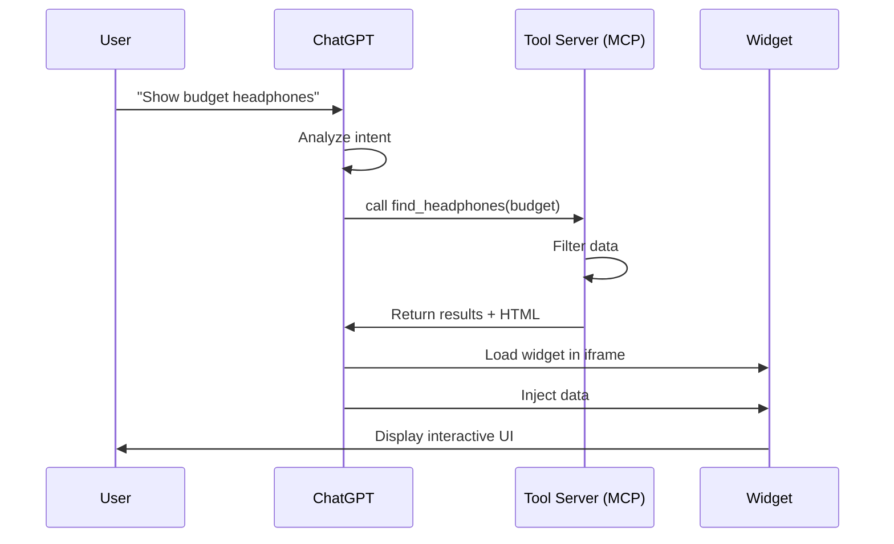

# Building ChatGPT Apps with MCP


<div class="pt-12">
  <span @click="$slidev.nav.next" class="px-2 py-1 rounded cursor-pointer" hover="bg-white bg-opacity-10">
   
  </span>
</div>

---
layout: center
class: text-center
---

# TechGear Demo

## An Electronics Shopping Assistant

<div class="mt-16 mb-20">
  <div class="inline-block px-8 py-6 bg-blue-50 dark:bg-blue-900/20 rounded-xl border-2 border-blue-300 dark:border-blue-700">
    <div class="text-3xl font-bold text-blue-700 dark:text-blue-300">
      "Show me budget headphones for gaming"
    </div>
  </div>
</div>

<div class="inline-block px-6 py-3 bg-gray-800 dark:bg-gray-700 rounded-lg hover:bg-gray-700 dark:hover:bg-gray-600 transition-colors">
  <a href="https://github.com/alexanderjt3/techgear" target="_blank" class="text-white no-underline flex items-center gap-2">
    <carbon:logo-github class="text-2xl"/> 
    <span class="text-lg font-semibold">github.com/alexanderjt3/techgear</span>
  </a>
</div>


---
layout: center
---

# What is a ChatGPT App?

<v-clicks>

- Interactive widgets that appear **inside** ChatGPT conversations
- Responds to natural language queries
- Renders rich UI (carousels, cards, charts, etc.)
- Combines AI understanding with custom business logic

</v-clicks>

<div class="mt-8 text-center">
  <a href="https://openai.com/index/introducing-apps-in-chatgpt/?video=1124696991" target="_blank" class="text-blue-500 hover:text-blue-600 underline">
    Learn more: Introducing Apps in ChatGPT
  </a>
</div>


---
layout: center
---

# What is Model Context Protocol (MCP)?

<v-clicks>

- **A standard way for AI apps to communicate** with external tools and data
- Think of it as **"USB for AI"** - a universal connector
- Defines how ChatGPT **discovers** and **calls** your tools
- Uses **JSON-RPC** - simple request/response messages over HTTP
- Open protocol created by Anthropic, adopted by OpenAI

</v-clicks>

<div v-click class="mt-8 p-4 bg-blue-500/10 rounded-lg">

**In Practice:** Your server exposes an `/mcp` endpoint, ChatGPT sends tool requests, you send back data + HTML

</div>

<div v-click class="mt-4 text-center text-sm opacity-75">
<a href="https://spec.modelcontextprotocol.io/" target="_blank" class="text-blue-500 hover:text-blue-600 underline">
Learn more: MCP Specification
</a>
</div>


---


# How It Works




---


# Tool Structure

ChatGPT apps are built on **tools** - functions that ChatGPT can call

```typescript 
// Tool Definition
{
  name: "find_headphones",
  description: "Find headphones based on filters",
  
  // Input schema (what ChatGPT sends)
  inputSchema: {
    priceBracket: "budget" | "midrange" | "premium",
    activity: "commuting" | "gaming" | "studio" | "fitness"
  },
  
  // Tool execution (your business logic)
  handler: async (input) => {
    const results = filterHeadphones(input);
    return { headphones: results };
  }
}
```

---

# Basic Parts of a ChatGPT App

<div class="grid grid-cols-3 gap-6 mt-8">

<div v-click="1" class="p-4 bg-purple-500/10 rounded-lg">

### 🖥️ Tool Server (MCP)
- Next.js application
- Exposes `/mcp` endpoint
- Handles JSON-RPC protocol
- Registers tools & resources

</div>

<div v-click="2" class="p-4 bg-blue-500/10 rounded-lg">

### 🎨 Widget Package
- React component
- Business logic
- Data & filtering
- Self-contained & reusable

</div>

<div v-click="3" class="p-4 bg-green-500/10 rounded-lg">

### 🧪 Playground
- Local testing environment
- MCPJam Inspector
- Debug before ChatGPT
- Free AI models

</div>

</div>

<div v-click="4" class="mt-8 text-center text-lg">
<strong>Tech Stack:</strong> Next.js + React + TypeScript + Zod + MCP SDK (protocol implementation)
</div>

---


# Project Layout

<style>
pre, code, .shiki {
  font-size: 0.55rem !important;
  line-height: 1.2 !important;
}
</style>

```
techgear/
├── packages/
│   ├── mcp/                          # Next.js Tool Server (MCP)
│   │   ├── src/
│   │   │   ├── app/
│   │   │   │   ├── mcp/route.ts      # MCP endpoint
│   │   │   │   ├── widgets/          # Preview pages
│   │   │   │   │   └── headphones/
│   │   │   │   │       └── page.tsx
│   │   │   │   └── page.tsx          # Homepage
│   │   │   └── lib/
│   │   │       ├── types.ts          # Type definitions
│   │   │       ├── helpers.ts        # Metadata creators
│   │   │       └── loadWidgets.ts    # Dynamic loader
│   │   ├── mcp.config.ts             # Widget registry
│   │   └── next.config.ts            # Critical config!
│   │
│   ├── widgets/
│   │   └── headphones-widget/        # Widget package
│   │       └── src/
│   │           ├── components/       # React UI
│   │           ├── data/             # Business logic
│   │           ├── hooks/            # ChatGPT integration
│   │           ├── semantic/         # Zod schemas
│   │           └── register.ts       # MCP registration
│   │
│   └── playground/                   # Testing
│       └── mcp.config.json           # Inspector config
```


---
layout: center
class: text-center
---

# Building a Widget

## Let's Break It Down

<div class="mt-12 grid grid-cols-5 gap-4">
  <div v-click="1" class="p-4 bg-blue-500/20 rounded">
    <div class="font-bold">1️⃣ Data</div>
    <div class="text-sm mt-1">`src/data/*`</div>
  </div>
  <div v-click="2" class="p-4 bg-purple-500/20 rounded">
    <div class="font-bold">2️⃣ Schemas</div>
    <div class="text-sm mt-1">`src/semantic/*`</div>
  </div>
  <div v-click="3" class="p-4 bg-green-500/20 rounded">
    <div class="font-bold">3️⃣ UI</div>
    <div class="text-sm mt-1">`src/components/*`</div>
  </div>
  <div v-click="4" class="p-4 bg-yellow-500/20 rounded">
    <div class="font-bold">4️⃣ Integration</div>
    <div class="text-sm mt-1">`src/hooks/*`</div>
  </div>
  <div v-click="5" class="p-4 bg-red-500/20 rounded">
    <div class="font-bold">5️⃣ Registration</div>
    <div class="text-sm mt-1">`src/register.ts`</div>
  </div>
</div>

---

# Step 1: Data & Logic

Here we structure our product data and create the filtering functions that will power our widget. This is the business logic layer - when ChatGPT calls our tool with filters like "budget" or "gaming", these functions determine what results to return.

<style>
pre, code, .shiki {
  font-size: 0.5rem !important;
  line-height: 1.2 !important;
}
</style>
```typescript 
// src/data/headphones.ts
export const HEADPHONES: Headphone[] = [
  {
    id: "arc-commuter",
    name: "ArcSound Metro ANC",
    priceBracket: "budget",
    activity: "commuting",
    style: "over-ear",
    price: "$99",
    description: "Lightweight ANC cans with USB-C fast charging",
  },
  // ... more headphones
];

export function filterHeadphones(
  priceBracket?: string,
  activity?: string,
  style?: string
): Headphone[] {
  return HEADPHONES.filter((headphone) => {
    const priceMatch = !priceBracket || 
                       priceBracket === "all" || 
                       headphone.priceBracket === priceBracket;
    const activityMatch = !activity || 
                          activity === "all" || 
                          headphone.activity === activity;
    return priceMatch && activityMatch;
  });
}
```

---

# Step 2: Zod Schemas

We use Zod to define schemas that serve double duty: they validate incoming data at runtime AND generate TypeScript types at compile time. This means we write the contract once and get both type safety and runtime protection. ChatGPT will use these schemas to understand what parameters it can send to our tool.

<style>
pre, code, .shiki {
  font-size: 0.5rem !important;
  line-height: 1.2 !important;
}
</style>

```typescript 
// src/semantic/contracts.ts
import z from "zod";

export const FindHeadphonesToolInputContract = z.object({
  priceBracket: z.enum(["budget", "midrange", "premium", "all"])
    .optional()
    .describe("Price range filter"),
  activity: z.enum(["commuting", "gaming", "studio", "fitness", "all"])
    .optional()
    .describe("Activity filter"),
});

export const HeadphoneContract = z.object({
  id: z.string(),
  name: z.string(),
  priceBracket: z.enum(["budget", "midrange", "premium"]),
  activity: z.enum(["commuting", "gaming", "studio", "fitness"]),
  price: z.string(),
  description: z.string(),
});

// TypeScript types inferred from schemas
export type FindHeadphonesToolInput = z.infer<typeof FindHeadphonesToolInputContract>;
export type Headphone = z.infer<typeof HeadphoneContract>;
```

<div class="mt-4 p-3 bg-yellow-500/10 rounded">
<strong>Why Zod?</strong> Single schema provides both compile-time types AND runtime validation!
</div>

---


# Step 3: ChatGPT Integration

When ChatGPT executes our tool, it injects the results into `window.openai.toolOutput`. We use React's `useSyncExternalStore` to listen for changes - when ChatGPT updates this value, our widget automatically re-renders with the new data. This also provides information like dark mode or window size.

<style>
pre, code, .shiki {
  font-size: 0.5rem !important;
  line-height: 1.2 !important;
}
</style>
```typescript 
// src/hooks/useOpenAI.ts
import { useSyncExternalStore } from "react";

// ChatGPT fires this event when it updates window.openai
const SET_GLOBALS_EVENT_TYPE = "openai:set_globals";

function useOpenAIGlobal<K extends keyof any>(key: K): any {
  return useSyncExternalStore(
    // Subscribe to changes
    (onChange) => {
      const handleSetGlobal = (event: CustomEvent) => {
        if (event.detail?.globals?.[key]) {
          onChange(); // Trigger React re-render
        }
      };
      window.addEventListener(SET_GLOBALS_EVENT_TYPE, handleSetGlobal);
      return () => window.removeEventListener(SET_GLOBALS_EVENT_TYPE, handleSetGlobal);
    },
    // Get current value
    () => window.openai?.[key] ?? null,
    () => null // Server snapshot
  );
}

// Hook to get widget data
export function useWidgetProps<T>(defaultState?: T): T | null {
  const toolOutput = useOpenAIGlobal("toolOutput") as T | null;
  const fallback = typeof defaultState === "function" ? defaultState() : defaultState;
  return toolOutput ?? fallback;
}
```

---

# Step 4: React Component

Now we build the actual UI that users see inside ChatGPT. Our component uses the `useWidgetProps` hook to receive filtered data from our tool.

<style>
pre, code, .shiki {
  font-size: 0.5rem !important;
  line-height: 1.2 !important;
}
</style>
```typescript
// src/components/HeadphonesWidget.tsx
"use client";
import { useWidgetProps } from "../hooks/useOpenAI";

export function HeadphonesWidget({ fallbackData }: HeadphonesWidgetProps) {
  // Get data from ChatGPT or use fallback for preview
  const toolOutput = useWidgetProps<{ headphones: Headphone[] }>(fallbackData);
  
  if (!toolOutput) {
    return <div className="flex items-center justify-center p-12">
      <div className="animate-spin rounded-full h-8 w-8 border-b-2" />
      <span className="ml-3">Loading headphones...</span>
    </div>;
  }

  const { headphones, summary } = toolOutput;

  return (
    <div className="min-h-screen bg-gradient-to-br from-gray-50 to-gray-100 p-6">
      <div className="max-w-6xl mx-auto">
        {summary && <p className="text-lg mb-6">{summary}</p>}
        <div className="grid grid-cols-1 md:grid-cols-2 lg:grid-cols-3 gap-6">
          {headphones.map((headphone) => (
            <HeadphoneCard key={headphone.id} headphone={headphone} />
          ))}
        </div>
      </div>
    </div>
  );
}
```

---

# Step 5: AI-Facing Descriptions

These prompts are how you "teach" ChatGPT about your tool.  ChatGPT reads these to decide when your tool is relevant and what parameters to pass. Think of this as writing documentation for an the LLM

<style>
pre, code, .shiki {
  font-size: 0.5rem !important;
  line-height: 1.2 !important;
}
</style>
```typescript 
// src/semantic/prompts.ts
export const headphonesWidgetPrompts = {
  toolTitle: "Find Headphones",
  
  toolDescription: `Find and filter headphones based on price, activity, and style.

Use this tool when users ask about headphones, earbuds, or audio equipment.

Examples:
- "Show me budget headphones"
- "Find gaming headphones"
- "I need over-ear headphones for commuting"
- "What headphones do you have for the gym?"

Filters: priceBracket (budget/midrange/premium), activity (commuting/gaming/studio/fitness)`,

  resourceTitle: "Headphones Widget HTML",
  resourceDescription: "HTML template for the interactive headphones carousel widget",
  widgetDescription: "Displays an interactive carousel of headphone recommendations",
};
```

<div  class="mt-4 p-3 bg-blue-500/10 rounded">
<strong>Pro Tip:</strong> Be explicit, provide examples, use natural language. ChatGPT learns from these descriptions!
</div>

---

# Step 6a: MCP Registration - Resource

Here we register our widget's HTML with the MCP server as a "resource". We fetch the rendered HTML from our Next.js page and wrap it in a special MIME type (`text/html+skybridge`) that tells ChatGPT "this is a widget template". The metadata describes what the widget does and how it should be displayed.

<style>
pre, code, .shiki {
  font-size: 0.5rem !important;
  line-height: 1.2 !important;
}
</style>

```typescript 
// src/register.ts
async function registerWidget(context: WidgetContext): Promise<void> {
  const { server, logger, getHtml, basePath } = context;
  
  // Fetch widget HTML from Next.js
  const html = await getHtml(basePath); // e.g., "/widgets/headphones"
  
  // STEP 1: Register HTML resource
  server.registerResource(
    "headphones-widget",                    // Resource name
    "ui://widget/headphones-template.html", // Template URI
    {
      title: headphonesWidgetPrompts.resourceTitle,
      mimeType: "text/html+skybridge",      // CRITICAL!
      _meta: createResourceMeta(
        headphonesWidgetPrompts.widgetDescription,
        true // prefersBorder
      ),
    },
    async (uri: URL) => ({
      contents: [{
        uri: uri.href,
        mimeType: "text/html+skybridge",
        text: `<html>${html}</html>`,
      }],
    })
  );
  // ... tool registration next
}
```

<div class="mt-4 p-3 bg-blue-500/10 rounded">
<strong>Key:</strong> The resource registration makes the widget HTML available to ChatGPT. The <code>mimeType</code> must be <code>text/html+skybridge</code>!
</div>

---

# Step 6b: MCP Registration - Tool

This is where we connect everything together! We register a tool that ChatGPT can call, linking it to our widget template via metadata. When called, the tool runs our filtering logic and returns data in `structuredContent` - which ChatGPT injects into the widget as `window.openai.toolOutput`. That's the full circle!

<style>
pre, code, .shiki {
  font-size: 0.5rem !important;
  line-height: 1.2 !important;
}
</style>

```typescript 
// src/register.ts (continued)
async function registerWidget(context: WidgetContext): Promise<void> {
  // ... resource registration above
  
  // STEP 2: Register tool
  server.registerTool(
    "find_headphones",                      // Tool name (what ChatGPT calls)
    {
      title: headphonesWidgetPrompts.toolTitle,
      description: headphonesWidgetPrompts.toolDescription,
      inputSchema: FindHeadphonesToolInputContract.shape,
      _meta: createWidgetMeta(headphonesWidgetMetadata), // Links to widget
    },
    async (input) => {
      // Filter headphones based on input
      const headphones = filterHeadphones(input.priceBracket, input.activity);
      
      return {
        content: [{ type: "text", text: "Found headphones" }],
        structuredContent: { headphones },     // Becomes window.openai.toolOutput
        _meta: createWidgetMeta(headphonesWidgetMetadata),
      };
    }
  );
}
```

<div class="mt-4 p-3 bg-purple-500/10 rounded">
<strong>Key:</strong> The <code>_meta</code> field links the tool to the widget template. The <code>structuredContent</code> becomes <code>window.openai.toolOutput</code>.
</div>


---
layout: center
class: text-center
---

# Tool Server Setup

## Bringing It All Together

<div class="mt-8 text-6xl">

</div>

---

# Tool Server Components

Building the Next.js server that hosts your MCP endpoint

<div class="grid grid-cols-3 gap-4 mt-8">

<div v-click="1" class="p-4 bg-blue-500/10 rounded-lg border-2 border-blue-500/30">

### 1️⃣ MCP.config
Widget registry  
`mcp.config.ts`

</div>

<div v-click="2" class="p-4 bg-purple-500/10 rounded-lg border-2 border-purple-500/30">

### 2️⃣ Endpoint
HTTP route handler  
`src/app/mcp/route.ts`

</div>

<div v-click="3" class="p-4 bg-green-500/10 rounded-lg border-2 border-green-500/30">

### 3️⃣ Tooling
Helpers & Load Widgets  
`src/lib/*`

</div>

<div v-click="4" class="p-4 bg-yellow-500/10 rounded-lg border-2 border-yellow-500/30">

### 4️⃣ Next.js Config
**Critical:** Asset prefix  
`next.config.ts`

</div>

<div v-click="5" class="p-4 bg-red-500/10 rounded-lg border-2 border-red-500/30">

### 5️⃣ HomePage
Server info & links  
`src/app/page.tsx`

</div>

<div v-click="6" class="p-4 bg-indigo-500/10 rounded-lg border-2 border-indigo-500/30">

### 6️⃣ Widget Page
React App
`src/app/widgets/*/page.tsx`

</div>

</div>

---

# 1️⃣ MCP.config - Widget Registry

This is your widget inventory - a simple config file that lists all available widgets and their settings. Each entry imports a widget package and specifies where it lives (`basePath`), whether it's enabled, and if it's production-ready. The server reads this file at startup to know which widgets to load.

<style>
pre, code, .shiki {
  font-size: 0.5rem !important;
  line-height: 1.3 !important;
}
</style>

```typescript 
// mcp.config.ts
import { headphonesWidgetPackage } from "headphones-widget";

interface WidgetRegistryEntry {
  package: WidgetPackage;
  mcp: {
    enabled: boolean;
    production: boolean;
    basePath: string;
  };
}

const config = {
  widgets: {
    headphones: {
      package: headphonesWidgetPackage,
      mcp: {
        enabled: true,
        production: true,
        basePath: "/widgets/headphones",
      },
    },
  },
};

export default config;
```

---

# 2️⃣ Endpoint - MCP Route Handler

This is an HTTP endpoint at `/mcp` that speaks JSON-RPC. ChatGPT sends requests here to discover tools and call them. We set up a context with logging and an HTML fetcher, then pass it to `loadWidgets()` which registers everything. Both GET and POST are supported for flexibility.

<style>
pre, code, .shiki {
  font-size: 0.5rem !important;
  line-height: 1.3 !important;
}
</style>

```typescript 
// src/app/mcp/route.ts
import { createMcpHandler } from "mcp-handler";
import { loadWidgets } from "@/lib/loadWidgets";

const handler = createMcpHandler(async (server) => {
  const context = {
    server,
    logger: {
      info: console.info.bind(console),
      error: console.error.bind(console),
    },
    getHtml: async (path: string) => {
      const baseURL = getBaseURL();
      return await fetch(`${baseURL}${path}`).then(r => r.text());
    },
  };
  
  await loadWidgets(context);  // Load all widgets
});

export const GET = handler;
export const POST = handler;
```

---

# 3️⃣ Tooling - Helpers & Load Widgets

These utilities handle the repetitive work of MCP registration. The metadata helpers create properly formatted `_meta` objects that ChatGPT expects - they add OpenAI-specific fields like widget descriptions and template URIs. The widget loader iterates through enabled widgets in your config and calls each one's `registerWidget()` function.

<div class="grid grid-cols-2 gap-6 mt-8">

<div>

### Metadata Helpers

<style>
pre, code, .shiki {
  font-size: 0.48rem !important;
  line-height: 1.2 !important;
}
</style>

```typescript
// src/lib/helpers.ts

// Create resource metadata
export function createResourceMeta(
  description: string,
  prefersBorder: boolean
) {
  return {
    "openai/widgetDescription": description,
    "openai/widgetPrefersBorder": prefersBorder,
  };
}

// Create widget metadata
export function createWidgetMeta(
  metadata: WidgetMetadata
) {
  return {
    "openai/outputTemplate": metadata.templateUri,
    "openai/toolInvocation/invoking": metadata.invoking,
    "openai/toolInvocation/invoked": metadata.invoked,
  };
}
```

</div>

<div>

### Widget Loader

```typescript
// src/lib/loadWidgets.ts

export async function loadWidgets(
  context: Omit<WidgetContext, "basePath">
) {
  const { logger } = context;
  
  // Filter enabled widgets
  const enabledWidgets = Object.entries(
    WIDGET_REGISTRY
  ).filter(([, entry]) => entry.mcp.enabled);
  
  // Register each widget
  for (const [widgetId, entry] of enabledWidgets) {
    const widgetContext = {
      ...context,
      basePath: entry.mcp.basePath,
    };
    
    await entry.package.registerWidget(
      widgetContext
    );
  }
}
```

</div>

</div>

---

# 4️⃣ Next.js Config - Critical Setup

This config solves a crucial problem: when ChatGPT loads your widget in an iframe, the HTML tries to load JavaScript from relative paths. Without `assetPrefix`, those scripts try to load from `chatgpt.com` instead of your server - resulting in blank pages! We set absolute URLs in development so all assets point back to your localhost.

<style>
pre, code, .shiki {
  font-size: 0.5rem !important;
  line-height: 1.3 !important;
}
</style>

```typescript 
// next.config.ts
import type { NextConfig } from "next";

// Makes script URLs absolute in development
function getAssetPrefix(): string {
  if (process.env.NODE_ENV === "development") {
    const port = process.env.PORT || 3000;
    return `http://localhost:${port}`;
  }
  return "";
}

const nextConfig: NextConfig = {
  assetPrefix: getAssetPrefix(),              // ⚡ CRITICAL!
  transpilePackages: ["headphones-widget"],
  output: "standalone",
};

export default nextConfig;
```

<div  class="mt-4 p-4 bg-red-500/10 rounded border-2 border-red-500/30">
<strong>Without this:</strong> Blank pages in ChatGPT! Scripts try to load from chatgpt.com instead of your server.
</div>

---

# 5️⃣ HomePage - Server Info

This is your server's front door - a simple landing page that shows what's available. It lists your widgets with links to preview pages, displays the MCP endpoint URL, and provides helpful information for developers. It's not required for functionality, but makes your server much more user-friendly to explore.

<style>
pre, code, .shiki {
  font-size: 0.55rem !important;
  line-height: 1.4 !important;
}
</style>

```tsx
// src/app/page.tsx
import Link from "next/link";

export default function HomePage() {
  return (
    <div className="min-h-screen bg-gradient-to-br from-blue-50 to-purple-50">
      <div className="max-w-4xl mx-auto p-8">
        <h1 className="text-4xl font-bold">TechGear Tool Server</h1>
        <p className="text-xl mt-4">ChatGPT App Development (using MCP)</p>
        
        <div className="mt-8 space-y-4">
          <h2 className="text-2xl font-semibold">Available Widgets</h2>
          <Link href="/widgets/headphones">
            🎧 Headphones Widget Preview
          </Link>
        </div>
        
        <div className="mt-8">
          <h2 className="text-2xl font-semibold">Endpoints</h2>
          <p className="mt-2">MCP Endpoint: <code>/mcp</code></p>
        </div>
      </div>
    </div>
  );
}
```

---

# 6️⃣ Widget Page

This Next.js page renders your widget for preview and testing. It's incredibly simple - just import your widget component and render it! When you visit `/widgets/headphones` in your browser, you see exactly what will appear in ChatGPT. This lets you iterate on styling and UI without going through the full MCP flow.

<style>
pre, code, .shiki {
  font-size: 0.55rem !important;
  line-height: 1.4 !important;
}
</style>

```tsx
// src/app/widgets/headphones/page.tsx
"use client";
import { HeadphonesWidget } from "headphones-widget";

export default function HeadphonesWidgetPage() {
  return <HeadphonesWidget />;
}
```

<div class="mt-8 grid grid-cols-2 gap-6">

<div >

### 🎯 Benefits
- Fast visual testing
- No MCP overhead
- Debug styling easily
- Immediate feedback

</div>

<div >

### 📍 Access
Visit: `localhost:3000/widgets/headphones`

Shows widget with fallback data

</div>

</div>

---

# Import Widget Config

How the server imports your widget

<style>
pre, code, .shiki {
  font-size: 0.6rem !important;
  line-height: 1.4 !important;
}
</style>

<div class="grid grid-cols-2 gap-6 mt-6">

<div>

### Widget Exports

```typescript
// headphones-widget/src/index.ts

export const headphonesWidgetPackage = {
  config: {
    id: "headphones",
    name: "Headphones Widget"
  },
  registerWidget: async (context) => {
    // Register tools & resources
  }
};
```

</div>

<div >

### Server Imports

```typescript
// mcp.config.ts

import { 
  headphonesWidgetPackage 
} from "headphones-widget";

const config = {
  widgets: {
    headphones: {
      package: headphonesWidgetPackage,
      mcp: { ... }
    }
  }
};
```

</div>

</div>

<div class="mt-8 p-4 bg-blue-500/10 rounded">

The `loadWidgets()` function reads this config and calls each widget's `registerWidget()` method

</div>

---

# That's All You Need! 

<div class="mt-8 text-center">

## The Tool Server Does 3 Things:

<div class="grid grid-cols-3 gap-8 mt-12">

<div  class="p-8 bg-blue-500/20 rounded-lg">

### 1. Import


</div>

<div  class="p-8 bg-purple-500/20 rounded-lg">

### 2. Configure


</div>

<div  class="p-8 bg-green-500/20 rounded-lg">

### 3. Load


</div>

</div>

</div>

<div v-click class="mt-12 p-6 bg-green-500/10 rounded-lg border-2 border-green-500/30 text-center">

### ✨ No tool logic, no UI code, no business rules in the server!

Everything lives in the widget package.

</div>

---
layout: center
class: text-center
---

# 🧪 Testing with MCPJam

## Test Locally Before Deploying

<div class="mt-8 grid grid-cols-2 gap-8">

<div v-click>

### Why MCPJam Inspector?
- 🔌 Connects to local tool server (MCP)
- 💬 Chat interface for testing
- 🔍 JSON-RPC message debugger
- 🎨 Widget preview
- 🆓 Free AI models included
- ⚡ Fast iteration cycle

</div>

<div v-click>

### Testing Workflow
1. Start tool server locally (MCP)
2. Launch MCPJam Inspector
3. Connect to your server
4. Test with natural language
5. Debug with message viewer
6. Iterate quickly

</div>

</div>

---

# Setup MCPJam Inspector

Quick setup in 2 steps

<div class="grid grid-cols-2 gap-8 mt-8">

<div>

### 1. Configuration

Create `packages/playground/mcp.config.json`:

<style>
pre, code, .shiki {
  font-size: 0.55rem !important;
  line-height: 1.3 !important;
}
</style>

```json
{
  "mcpServers": {
    "TechGear": {
      "url": "http://localhost:3000/mcp",
      "type": "http"
    }
  }
}
```

</div>

<div >

### 2. Launch Both

```bash
# Terminal 1: Tool server (MCP)
cd packages/mcp
npm run dev

# Terminal 2: Inspector
cd packages/playground
npm run inspector
```

<div class="mt-4 p-3 bg-blue-500/10 rounded">

Inspector opens at: `http://127.0.0.1:6274`

</div>

</div>

</div>

---

# Testing in Inspector

<div class="grid grid-cols-2 gap-8 mt-8">

<div>

### Connect to Server

1. Click **Servers** tab
2. Find "TechGear"
3. Click **Connect**
4. Wait for ✅ green checkmark
5. Go to **Playground** tab

</div>

<div v-click>

### Test with Prompts

```
Show me headphones
```

```
Find budget headphones for gaming
```

```
I need over-ear headphones for commuting
```

<div class="mt-4 p-3 bg-green-500/10 rounded">

✅ Widget renders with filtered results

</div>

</div>

</div>

---

# Debugging Tools

<div class="grid grid-cols-2 gap-8 mt-8">

<div>

### Messages Tab
View raw JSON-RPC protocol

<style>
pre, code, .shiki {
  font-size: 0.45rem !important;
  line-height: 1.1 !important;
}
</style>

```json
// Tool call request
{
  "method": "tools/call",
  "params": {
    "name": "find_headphones",
    "arguments": {
      "priceBracket": "budget"
    }
  }
}

// Tool response
{
  "structuredContent": {
    "headphones": [...]
  },
  "_meta": {
    "openai/outputTemplate": "ui://..."
  }
}
```

</div>

<div v-click>

### Browser DevTools (F12)

**Console Tab**
```javascript
window.openai?.toolOutput
```

**Network Tab**
- Check asset loading (200 OK)
- Verify absolute URLs
- Look for 404 errors

**Elements Tab**
- Inspect HTML structure
- Check Tailwind classes

</div>

</div>


---
layout: center
class: text-center
---

# What You've Learned

<div class="grid grid-cols-3 gap-8 mt-12">

<div v-click="1" class="p-6 bg-blue-500/20 rounded-lg">

### Widget Package
Self-contained logic  
Zod validation  
React components  
MCP registration

</div>

<div v-click="2" class="p-6 bg-purple-500/20 rounded-lg">

### Tool Server (MCP)
Widget registry  
Dynamic loading  
JSON-RPC endpoint  
Asset configuration

</div>

<div v-click="3" class="p-6 bg-green-500/20 rounded-lg">

### Testing Flow
Preview pages  
MCPJam Inspector  
Browser DevTools  
Production ready

</div>

</div>


---

# Next Steps

Your path to building ChatGPT apps

<div class="mt-8 grid grid-cols-2 gap-8">

<div>

### Getting Started


1. 📥 Clone the TechGear repo
2. 📖 Read DEVELOPER_GUIDE.md
3. 🏗️ Build your first widget
4. 🧪 Test with MCPJam


</div>

<div v-click>

### Resources

**Documentation**
- [OpenAI Apps SDK](https://developers.openai.com/apps-sdk)
- [MCP Specification](https://spec.modelcontextprotocol.io/)
- [MCPJam Inspector](https://docs.mcpjam.com/)

**TechGear Files**
- `DEVELOPER_GUIDE.md`
- `QUICK_REFERENCE.md`


</div>

</div>


---
layout: end
---

# Thank You!

### Building ChatGPT Apps with MCP

<div class="mt-12 text-xl opacity-75">

Questions....? --> Check DEVELOPER_GUIDE.md

</div>

<div class="mt-8 text-base opacity-50">

TechGear - An educational guide to the Model Context Protocol

</div>
